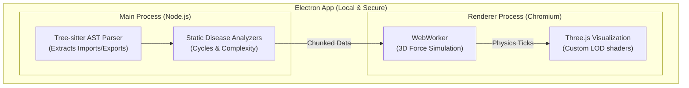

  
  
  <h1>Software MRI</h1>
  
  
<strong>A fundamentally new way for humans to understand software systems.</strong>

  

    
    
    
  

  

    <a href="https://ishaan-sharma-tech.github.io/software-mri"><b>Live Website</b></a> • 
    <a href="https://github.com/Ishaan-Sharma-tech/software-mri/releases/latest"><b>Download (.exe)</b></a> • 
    <a href="mailto:ishaansharma2010work@gmail.com"><b>Contact</b></a> • 
    <a href="[https://twitter.com/your-twitter](https://x.com/IshaanSharmaDev)"><b>Twitter</b></a> 
  

---

## 🌌 The Problem

Modern codebases are massive, tangled webs of hundreds of files, circular dependencies, and hidden logic. When joining a new project or planning a major refactor, developers spend **weeks** just trying to map out how the code works in their head.

We were tired of getting lost in 10,000-file repositories. 

## 🚀 The Solution

**Software MRI** transforms your codebase into a living, breathing 3D digital organism. 

Instead of reading text top-to-bottom, you **fly through your architecture** in a beautiful 3D galaxy. You can visually uncover architectural flaws, trace execution bloodflow, and master any project in seconds.

## ✨ Features

- **Blazing Fast 3D Simulation:** Powered by a custom WebWorker physics engine and Aggressive Level-of-Detail (LOD). Easily renders 5,000+ file repositories at 60 FPS without freezing your UI.
- **Universal Language Support:** 300+ programming languages supported out of the box via `tree-sitter` AST parsing.
- **Disease Detection:** Instantly spot circular dependencies, massive files, and extreme cyclomatic complexity with glowing red hazard indicators.
- **100% Local & Private:** Your code never leaves your machine. No telemetry. No cloud required. 

---

## 🛠️ How it Works (Under the Hood)

Software MRI uses a chunked, multi-layered static analysis pipeline:

---

## 📥 Installation

1. Head over to the **[Releases Page](https://github.com/Ishaan-Sharma-tech/software-mri/releases/latest)**.
2. Download the latest `Software.MRI.Setup.X.X.X.exe`.
3. Run the installer (it takes 5 seconds and requires zero setup).
4. Drag and drop any local folder into the app to watch it come alive!

*(Note: MacOS and Linux builds are on the roadmap!)*

## 🤝 Contributing

We would absolutely love your help making Software MRI the ultimate developer tool! Whether it's adding new language support, optimizing the Three.js shaders, or fixing bugs:

1. Clone the repo: `git clone https://github.com/Ishaan-Sharma-tech/software-mri.git`
2. Install dependencies: `npm ci`
3. Run the dev server: `npm run dev`

Check out our [CONTRIBUTING.md](CONTRIBUTING.md) for a deep dive into the architecture and how to submit PRs!

## 📄 License

This project is licensed under the MIT License - see the LICENSE file for details.
