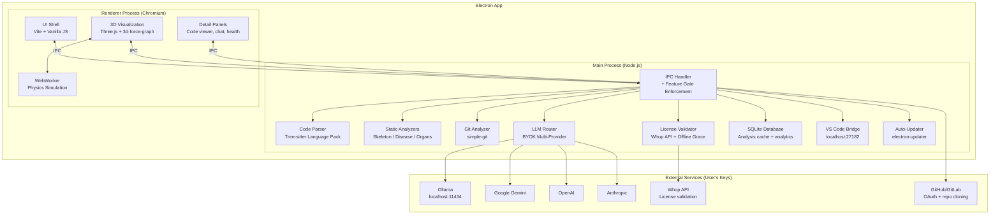

# Software MRI — Implementation Plan v2

> A fundamentally new way for humans to understand software systems.
> Upload a codebase → see it come alive as a living digital organism.

**App name:** Software MRI
**Platform:** Electron desktop app (Windows first, macOS/Linux later)
**Cost to build:** $0
**Payment processor:** Whop (5% + $0.50 per sale, zero upfront)
**LLM strategy:** BYOK (Ollama / Gemini / OpenAI / Anthropic)
**Language support:** 300+ via tree-sitter-language-pack

---

## Decisions Locked (from /grill-me interview)

| Decision | Choice |
|----------|--------|
| Payment processor | Whop |
| Free tier | 500 files, Layers 1 + 5 only |
| Pro tier | $9/mo or $79/yr — unlimited files, all 5 layers, GitHub OAuth |
| Team tier | $49/mo per workspace (5 seats included, +$9/seat) |
| First launch | Demo project shown → dismissible → empty state. Demo in Help menu. |
| Platform priority | Windows first. macOS/Linux via CI/CD later. |
| Language support | tree-sitter-language-pack (300+ grammars, on-demand) + regex fallback |
| Theme | Dark default + light mode toggle from Day 1 |
| LLM | BYOK only. Layers 2-4 require user-configured LLM. |
| Whop flow | Upgrade → system browser → Whop checkout → local callback → OS keychain |
| License validation | Every 7 days online, 30-day offline grace period |
| Share/Export | PNG with subtle branding + clipboard + pre-filled tweet. Free for all tiers. |
| VS Code extension | Phase 9 (post-launch) |
| App name | "Software MRI" — final |

---

## Architecture



### Why This Architecture

- **Feature gates in main process (IPC layer):** Free users can't bypass Pro features by hacking the UI — the main process checks the license tier before executing any gated operation
- **Electron:** Native file system access, OS keychain for API keys + license, auto-updates, MSIX packaging, system tray
- **WebWorker for physics:** 3D force simulation off the main thread — UI never freezes, even with 5000+ nodes
- **Chunked analyzer:** Files analyzed in 200-file batches with progress events — users see partial results immediately
- **Local-first:** All data stays on the user's machine. No telemetry. No cloud dependency.

---

## Tech Stack

| Component | Technology | Package | Cost |
|-----------|-----------|---------|------|
| Desktop framework | Electron | `electron` | Free |
| Frontend bundler | Vite | `vite` | Free |
| 3D visualization | Three.js + 3d-force-graph | `three`, `3d-force-graph` | Free |
| Camera animations | GSAP | `gsap` | Free |
| Code parsing | Tree-sitter Language Pack | `@kreuzberg/tree-sitter-language-pack` | Free |
| Dependency graphs | Custom (tree-sitter based) | — | Free |
| Git analysis | simple-git | `simple-git` | Free |
| Code metrics | typhonjs-escomplex + sloc | `typhonjs-escomplex`, `sloc` | Free |
| Duplication detection | jscpd | `jscpd` | Free |
| Database | better-sqlite3 | `better-sqlite3` | Free |
| Keychain | keytar | `keytar` | Free |
| Auto-updates | electron-updater | `electron-updater` | Free |
| MSIX packaging | electron-builder | `electron-builder` | Free |
| Syntax highlighting | Prism.js | `prismjs` | Free |
| Font | Inter | Google Fonts | Free |
| Payment | Whop | API | Free (5%+$0.50 per sale) |
| CI/CD | GitHub Actions | — | Free (public repo) |

---

## Project Structure

```
software-mri/
├── package.json
├── electron-builder.yml              # Electron builder config (NSIS + MSIX)
├── vite.config.js                     # Vite config with Electron integration
├── .github/
│   └── workflows/
│       └── release.yml                # CI/CD: build Win/Mac/Linux on tag push
│
├── main/                              # Electron Main Process
│   ├── index.js                       # App entry — window, tray, lifecycle
│   ├── preload.js                     # Context bridge (IPC exposed to renderer)
│   ├── ipc/
│   │   ├── handlers.js                # Register all IPC handlers
│   │   ├── gate.js                    # Feature gate middleware (checks tier)
│   │   ├── analyze.js                 # IPC: start/cancel/status analysis
│   │   ├── project.js                 # IPC: load/save/list projects
│   │   ├── query.js                   # IPC: LLM Q&A (Brain layer)
│   │   ├── settings.js                # IPC: LLM provider config
│   │   ├── license.js                 # IPC: license operations
│   │   ├── share.js                   # IPC: PNG export
│   │   └── github.js                  # IPC: GitHub OAuth + repo import
│   │
│   ├── analyzers/
│   │   ├── pipeline.js                # Orchestrates all analyzers, chunked
│   │   ├── skeleton.js                # Layer 1: file tree, structure, stats
│   │   ├── dependencies.js            # Layer 1: imports, dependency graph
│   │   ├── organs.js                  # Layer 2: semantic clustering (Pro)
│   │   ├── bloodflow.js               # Layer 3: data flow tracing (Pro)
│   │   ├── brain.js                   # Layer 4: business logic Q&A (Pro)
│   │   ├── disease.js                 # Layer 5: code health & problems
│   │   └── archaeology.js             # Git history & evolution (Pro)
│   │
│   ├── parsers/
│   │   ├── treesitter.js              # Tree-sitter language pack integration
│   │   ├── language-detector.js       # Detect language from extension
│   │   ├── extractor.js               # Extract functions, classes, imports
│   │   └── regex-fallback.js          # Regex import extraction (fallback)
│   │
│   ├── llm/
│   │   ├── router.js                  # Multi-provider BYOK router
│   │   ├── providers/
│   │   │   ├── ollama.js
│   │   │   ├── openai.js
│   │   │   ├── gemini.js
│   │   │   └── anthropic.js
│   │   ├── prompts/
│   │   │   ├── classify-module.js     # Organ detection
│   │   │   ├── explain-flow.js        # Business logic explanation
│   │   │   ├── summarize-file.js      # File summary
│   │   │   └── answer-question.js     # Q&A
│   │   └── confidence.js              # Confidence scoring (verified/high/inferred)
│   │
│   ├── licensing/
│   │   ├── validator.js               # Whop API license validation
│   │   ├── keychain.js                # OS keychain read/write (keytar)
│   │   ├── tiers.js                   # Tier definitions + feature flags
│   │   └── grace.js                   # Offline grace period logic
│   │
│   ├── bridge/
│   │   └── server.js                  # Local HTTP server on port 27182
│   │
│   ├── updater/
│   │   └── auto-update.js             # electron-updater setup
│   │
│   ├── db/
│   │   ├── schema.js                  # SQLite schema (projects, analysis, analytics)
│   │   ├── projects.js                # Project CRUD
│   │   ├── cache.js                   # Analysis result caching
│   │   └── analytics.js               # Local usage analytics
│   │
│   └── utils/
│       ├── git.js                     # Git history utilities
│       ├── metrics.js                 # Code complexity calculations
│       ├── heuristics.js              # Domain signal detection (no-LLM)
│       └── fs-helpers.js              # File system utilities
│
├── src/                               # Renderer Process (Vite)
│   ├── index.html                     # App shell
│   ├── main.js                        # Renderer entry point
│   │
│   ├── styles/
│   │   ├── tokens.css                 # Design tokens (colors, spacing, type)
│   │   ├── theme-dark.css             # Dark theme variables
│   │   ├── theme-light.css            # Light theme variables
│   │   ├── base.css                   # Resets, global styles, scrollbars
│   │   ├── layout.css                 # Full-viewport layout grid
│   │   ├── panels.css                 # Side panels, modals, overlays
│   │   ├── components.css             # Buttons, inputs, cards, badges
│   │   └── animations.css             # Transitions, keyframes, micro-animations
│   │
│   ├── core/
│   │   ├── app.js                     # App controller + router
│   │   ├── state.js                   # Global state management
│   │   ├── ipc-client.js              # IPC bridge wrapper (renderer side)
│   │   ├── events.js                  # Event bus
│   │   └── theme.js                   # Theme switcher (dark/light)
│   │
│   ├── workers/
│   │   └── physics.worker.js          # WebWorker: force simulation
│   │
│   ├── visualization/
│   │   ├── scene.js                   # Three.js scene, renderer, post-processing
│   │   ├── graph.js                   # 3d-force-graph wrapper + data binding
│   │   ├── layers.js                  # Layer toggle system (1-5)
│   │   ├── semantic-zoom.js           # LOD manager (dots → spheres → labels → code)
│   │   ├── node-renderer.js           # Custom node rendering per zoom level
│   │   ├── edge-renderer.js           # Link rendering + animated particles
│   │   ├── camera.js                  # Camera controller + fly-to animations
│   │   ├── effects.js                 # Bloom, glow, ambient particles
│   │   ├── minimap.js                 # Overview minimap in corner
│   │   └── screenshot.js             # Canvas capture for PNG export
│   │
│   ├── screens/
│   │   ├── welcome.js                 # First launch: demo + onboarding
│   │   ├── empty.js                   # Empty state: drag-drop, buttons, recents
│   │   ├── explorer.js                # Main visualization screen
│   │   └── settings.js                # Full settings page
│   │
│   ├── components/
│   │   ├── titlebar.js                # Custom titlebar (frameless window)
│   │   ├── toolbar.js                 # Left toolbar: layers, search, share, settings
│   │   ├── detail-panel.js            # Right panel: node details, code preview
│   │   ├── code-viewer.js             # Syntax-highlighted code (Prism.js)
│   │   ├── chat.js                    # Brain layer Q&A interface
│   │   ├── briefing.js                # Post-analysis summary cards
│   │   ├── health-dashboard.js        # Disease layer dashboard
│   │   ├── timeline.js                # Git history timeline scrubber
│   │   ├── file-counter.js            # "342/500 files" Free tier badge
│   │   ├── upgrade-modal.js           # Paywall UI — feature comparison + CTA
│   │   ├── onboarding.js              # Personalized tour overlay
│   │   ├── llm-setup.js               # BYOK provider config panel
│   │   ├── share-button.js            # PNG export + tweet button
│   │   ├── github-import.js           # GitHub OAuth repo browser
│   │   ├── search.js                  # Global search (files, functions, organs)
│   │   ├── toast.js                   # Toast notification system
│   │   └── progress.js                # Analysis progress bar with chunks
│   │
│   └── utils/
│       ├── colors.js                  # Color palettes + language color map
│       ├── format.js                  # Number/date/size formatting
│       ├── dom.js                     # DOM utilities
│       └── keyboard.js                # Keyboard shortcut manager
│
├── demo/
│   └── express-demo.json              # Pre-analyzed Express.js project data
│
└── assets/
    ├── icon.ico                       # App icon (Windows)
    ├── icon.png                       # App icon (high-res)
    ├── watermark.png                  # Subtle branding for PNG export
    └── fonts/
        └── Inter-Variable.woff2       # Bundled font (no network dependency)
```

---

## Tier Feature Gate Matrix

Features are enforced at the **IPC layer in the main process** — not just hidden in the UI.

| Feature | Free | Pro ($9/mo) | Team ($49/mo) |
|---------|------|-------------|---------------|
| Layer 1 — Skeleton | ✅ | ✅ | ✅ |
| Layer 5 — Disease Detection | ✅ | ✅ | ✅ |
| Layer 2 — Organs | ❌ | ✅ | ✅ |
| Layer 3 — Blood Flow | ❌ | ✅ | ✅ |
| Layer 4 — Brain (Q&A) | ❌ | ✅ | ✅ |
| Git Archaeology | ❌ | ✅ | ✅ |
| GitHub/GitLab OAuth Import | ❌ | ✅ | ✅ |
| File limit | 500 files | Unlimited | Unlimited |
| PNG Export (with branding) | ✅ | ✅ | ✅ |
| LLM Provider Config | ✅ (for demo) | ✅ | ✅ |
| Shared analysis cache | ❌ | ❌ | ✅ |
| Saved/pinned views | ❌ | ❌ | ✅ |
| Team admin dashboard | ❌ | ❌ | ✅ |
| File counter in toolbar | Visible | Hidden | Hidden |
| Upgrade modal | Shown on Pro features | Hidden | Hidden |

### IPC Gate Enforcement Pattern

```javascript
// main/ipc/gate.js
function requireTier(requiredTier, handler) {
  return async (event, ...args) => {
    const currentTier = await license.getCurrentTier();
    const tierOrder = { free: 0, pro: 1, team: 2 };
    if (tierOrder[currentTier] < tierOrder[requiredTier]) {
      return { error: 'UPGRADE_REQUIRED', requiredTier, currentTier };
    }
    return handler(event, ...args);
  };
}

// Usage in handlers.js
ipcMain.handle('analyze:organs', requireTier('pro', analyzeOrgans));
ipcMain.handle('analyze:bloodflow', requireTier('pro', analyzeBloodflow));
ipcMain.handle('query:brain', requireTier('pro', queryBrain));
ipcMain.handle('github:import', requireTier('pro', githubImport));
// Free features — no gate
ipcMain.handle('analyze:skeleton', analyzeSkeleton);
ipcMain.handle('analyze:disease', analyzeDisease);
ipcMain.handle('share:png', exportPNG);
```

---

## Phase 0 — Foundation (Days 1-4)

> **Goal:** Electron app boots, shows custom titlebar, dark/light theme, bundled demo project renders a 3D view in <500ms. Beautiful empty state when no project is open.

---

### [NEW] package.json

```json
{
  "name": "software-mri",
  "version": "0.1.0",
  "description": "See your software. Understand your software.",
  "main": "main/index.js",
  "scripts": {
    "dev": "concurrently \"vite\" \"wait-on http://localhost:5173 && electron .\"",
    "build": "vite build && electron-builder",
    "build:msix": "vite build && electron-builder --win msix"
  }
}
```

**Core dependencies:**
- `electron`, `electron-builder`, `electron-updater`
- `vite`, `concurrently`, `wait-on`
- `three`, `3d-force-graph`, `gsap`
- `@kreuzberg/tree-sitter-language-pack`
- `simple-git`, `typhonjs-escomplex`, `sloc`, `jscpd`
- `better-sqlite3`, `keytar`
- `prismjs`

---

### [NEW] main/index.js — Electron entry

- Create `BrowserWindow` with `frame: false` (custom titlebar)
- Window size: 1400×900 default, remembers last position/size
- Load Vite dev server in development, bundled HTML in production
- Register IPC handlers via `main/ipc/handlers.js`
- Initialize SQLite database
- Start VS Code bridge server on port 27182 (silent, no UI)
- Check for updates silently (electron-updater)
- System tray icon with "Open Software MRI" and "Quit"

### [NEW] main/preload.js — Context bridge

Exposes a safe `window.smri` API to the renderer:

```javascript
contextBridge.exposeInMainWorld('smri', {
  // Analysis
  analyze: (projectPath) => ipcRenderer.invoke('analyze:start', projectPath),
  getStatus: (id) => ipcRenderer.invoke('analyze:status', id),
  onProgress: (cb) => ipcRenderer.on('analyze:progress', (_, data) => cb(data)),

  // Project
  openFolder: () => ipcRenderer.invoke('project:openFolder'),
  getProject: (id) => ipcRenderer.invoke('project:get', id),
  listProjects: () => ipcRenderer.invoke('project:list'),

  // License
  getTier: () => ipcRenderer.invoke('license:tier'),
  activateKey: (key) => ipcRenderer.invoke('license:activate', key),
  openUpgrade: () => ipcRenderer.invoke('license:openUpgrade'),

  // LLM
  setProvider: (config) => ipcRenderer.invoke('llm:setProvider', config),
  getProvider: () => ipcRenderer.invoke('llm:getProvider'),
  testConnection: () => ipcRenderer.invoke('llm:testConnection'),

  // Layers (gated)
  getOrgans: (id) => ipcRenderer.invoke('analyze:organs', id),
  getBloodFlow: (id) => ipcRenderer.invoke('analyze:bloodflow', id),
  queryBrain: (id, question) => ipcRenderer.invoke('query:brain', id, question),
  getArchaeology: (id) => ipcRenderer.invoke('analyze:archaeology', id),

  // Share
  exportPNG: (dataUrl) => ipcRenderer.invoke('share:exportPNG', dataUrl),

  // Settings
  getSettings: () => ipcRenderer.invoke('settings:get'),
  setSettings: (s) => ipcRenderer.invoke('settings:set', s),

  // Window
  minimize: () => ipcRenderer.invoke('window:minimize'),
  maximize: () => ipcRenderer.invoke('window:maximize'),
  close: () => ipcRenderer.invoke('window:close'),

  // Theme
  getTheme: () => ipcRenderer.invoke('settings:getTheme'),
  setTheme: (t) => ipcRenderer.invoke('settings:setTheme', t),
});
```

### [NEW] src/index.html

- `<!DOCTYPE html>` with meta tags, bundled Inter font, no external network requests
- `<div id="app">` container
- Custom titlebar div at top (drag region + minimize/maximize/close buttons)
- Links to CSS: tokens.css, theme-dark.css, base.css, layout.css, etc.

### [NEW] src/styles/tokens.css — Design system tokens

```css
:root {
  /* Typography */
  --font-family: 'Inter', -apple-system, BlinkMacSystemFont, sans-serif;
  --font-mono: 'JetBrains Mono', 'Fira Code', monospace;

  /* Spacing scale */
  --space-1: 4px;  --space-2: 8px;  --space-3: 12px;
  --space-4: 16px; --space-5: 24px; --space-6: 32px;
  --space-7: 48px; --space-8: 64px;

  /* Radius */
  --radius-sm: 6px;  --radius-md: 10px;
  --radius-lg: 16px; --radius-xl: 24px; --radius-full: 9999px;

  /* Shadows */
  --shadow-sm: 0 1px 3px rgba(0,0,0,0.3);
  --shadow-md: 0 4px 12px rgba(0,0,0,0.4);
  --shadow-lg: 0 12px 40px rgba(0,0,0,0.5);
  --shadow-glow: 0 0 20px rgba(59,130,246,0.3);

  /* Transitions */
  --transition-fast: 150ms ease;
  --transition-normal: 250ms ease;
  --transition-slow: 400ms ease;

  /* Z-index layers */
  --z-base: 1; --z-panel: 10; --z-toolbar: 20;
  --z-modal: 100; --z-toast: 200; --z-titlebar: 300;
}
```

### [NEW] src/styles/theme-dark.css

```css
[data-theme="dark"] {
  --bg-primary: #0a0e17;
  --bg-secondary: #111827;
  --bg-tertiary: #1f2937;
  --bg-glass: rgba(17, 24, 39, 0.8);
  --bg-glass-hover: rgba(31, 41, 55, 0.9);

  --text-primary: #f3f4f6;
  --text-secondary: #9ca3af;
  --text-muted: #6b7280;

  --border-default: rgba(255,255,255,0.08);
  --border-hover: rgba(255,255,255,0.15);

  --accent-blue: #3b82f6;
  --accent-violet: #8b5cf6;
  --accent-emerald: #10b981;
  --accent-rose: #f43f5e;
  --accent-amber: #f59e0b;
  --accent-cyan: #06b6d4;

  --gradient-primary: linear-gradient(135deg, #3b82f6, #8b5cf6);
  --gradient-success: linear-gradient(135deg, #10b981, #06b6d4);
  --gradient-danger: linear-gradient(135deg, #f43f5e, #f59e0b);
}
```

### [NEW] src/styles/theme-light.css

```css
[data-theme="light"] {
  --bg-primary: #f8fafc;
  --bg-secondary: #ffffff;
  --bg-tertiary: #f1f5f9;
  --bg-glass: rgba(255, 255, 255, 0.85);
  --bg-glass-hover: rgba(241, 245, 249, 0.95);

  --text-primary: #0f172a;
  --text-secondary: #475569;
  --text-muted: #94a3b8;

  --border-default: rgba(0,0,0,0.08);
  --border-hover: rgba(0,0,0,0.15);

  /* Same accent colors — they work on both backgrounds */
  --accent-blue: #2563eb;
  --accent-violet: #7c3aed;
  --accent-emerald: #059669;
  --accent-rose: #e11d48;
  --accent-amber: #d97706;
  --accent-cyan: #0891b2;

  --gradient-primary: linear-gradient(135deg, #2563eb, #7c3aed);
  --gradient-success: linear-gradient(135deg, #059669, #0891b2);
  --gradient-danger: linear-gradient(135deg, #e11d48, #d97706);
}
```

### [NEW] src/components/titlebar.js — Custom window titlebar

- Drag region spanning the top
- App icon + "Software MRI" title on the left
- Theme toggle (sun/moon icon) in center-right area
- Minimize / maximize / close buttons on the right (Windows-style)
- Calls `window.smri.minimize()`, `.maximize()`, `.close()` via IPC

### [NEW] demo/express-demo.json — Bundled demo project

- Pre-analyzed data from a real Express.js starter (~200 files)
- Contains pre-computed: skeleton (files, folders, stats), dependency graph (nodes + edges), disease results (complexity, circular deps), organ classifications (auth, routes, database, middleware)
- Loads in <100ms — parsed from JSON, no analysis needed
- Used on first launch and accessible from Help → "Open Demo Project"

### [NEW] src/screens/welcome.js — First launch experience

- Full-screen overlay shown only on first launch (tracks in localStorage)
- Personalization question: "What brings you to Software MRI?"
  - Options: "Joining a new codebase" / "Planning a refactor" / "Code review" / "Learning"
  - Stores answer — adapts onboarding tour to highlight relevant layers
- After selection → loads demo project → shows briefing → enters 3D explorer
- "Skip tour" link in corner

### [NEW] src/screens/empty.js — Beautiful empty state

- Shown when no project is open (after dismissing demo or on subsequent launches)
- Large animated drag-and-drop zone with pulsing border gradient
- Three action buttons:
  - "Open Folder" — opens native folder picker
  - "Import from GitHub" — shows Pro badge if Free tier, opens GitHub import
  - "Open Demo Project" — loads bundled demo
- Recent projects list below (icon per primary language, name, date, file count)
- Subtle animated background (slow-moving gradient mesh or floating particles)
- **Never a blank screen at any point**

### [NEW] src/core/theme.js — Theme switcher

```javascript
// Reads from settings, applies data-theme attribute
// Persists choice in SQLite via IPC
// Smooth crossfade transition between themes
function setTheme(theme) {
  document.documentElement.setAttribute('data-theme', theme);
  window.smri.setTheme(theme);
}
```

---

## Phase 1 — Skeleton Layer (Days 5-14)

> **Goal:** Open a local folder → chunked analysis with real-time progress → 3D force-directed graph with aggressive LOD. WebWorker physics. Briefing page with instant insights. Works for repos up to 10K files.

---

### [NEW] main/analyzers/pipeline.js — Chunked analysis orchestrator

- Accepts a folder path
- Walks the file tree, collects all source files (ignores node_modules, .git, dist, build, vendor, __pycache__)
- **Chunked processing:**
  - Sorts files by importance: most-imported files first (detected via quick filename heuristic), then by size
  - Processes in **200-file chunks**
  - After each chunk: sends `analyze:progress` event to renderer with partial results
  - Renderer can display partial skeleton while analysis continues
- Respects 500-file limit for Free tier (checks via `license.getCurrentTier()`)
- Generates a unique project ID, stores results in SQLite

### [NEW] main/analyzers/skeleton.js — Layer 1: Structure

For each file:
- Path, name, extension, size in bytes
- Language detection (from extension via `language-detector.js`)
- Line counts via `sloc`: total, source, comments, blank
- Parse with tree-sitter (language pack) → extract:
  - Imports (resolved to relative paths where possible)
  - Exports (named + default)
  - Functions (name, line range, param count)
  - Classes (name, method names)

Aggregate stats:
- Total files, total lines, language breakdown (% per language)
- Directory structure as nested tree
- "Most interesting" insights (computed heuristics):
  - Most connected file (highest import count)
  - Largest file
  - Most languages
  - Deepest nesting

### [NEW] main/analyzers/dependencies.js — Layer 1: Dependency graph

- Build adjacency list from import/export data
- Resolve relative imports to actual file paths
- External dependencies tracked separately (npm packages, pip packages, etc.)
- Calculate per-file coupling metrics:
  - **Afferent coupling (Ca):** how many files import this file
  - **Efferent coupling (Ce):** how many files this file imports
  - **Instability index (I):** Ce / (Ca + Ce)
- **Output:** `{ nodes: [...], edges: [...] }` ready for 3d-force-graph

### [NEW] main/parsers/treesitter.js — Tree-sitter language pack

```javascript
import { createParser } from '@kreuzberg/tree-sitter-language-pack';

// On-demand grammar loading — downloads WASM on first use per language
// Caches locally for subsequent uses
async function parseFile(filePath, content, language) {
  const parser = await createParser(language);
  const tree = parser.parse(content);
  return extractStructure(tree, language);
}
```

- Supports 300+ languages via on-demand WASM download
- Falls back to `regex-fallback.js` if grammar unavailable

### [NEW] main/parsers/regex-fallback.js — Regex import extraction

- For languages without tree-sitter grammar
- Pattern-matches common import syntaxes:
  - `import ... from '...'` (ES modules)
  - `require('...')` (CommonJS)
  - `from ... import ...` (Python)
  - `import ...` (Java, Go)
  - `use ...;` (Rust, PHP)
  - `#include` (C/C++)
- Returns basic structure: imports list, function signatures (by regex)

### [NEW] src/workers/physics.worker.js — WebWorker physics

- Receives graph data (nodes + edges) from main thread
- Runs `d3-force-3d` simulation in the worker
  - Forces: charge (repel), link (attract connected), center, collision
  - Custom clustering force: same-directory nodes attract
- Posts updated node positions to main thread every animation frame via `postMessage`
- Uses `SharedArrayBuffer` if available for zero-copy position transfer
- Simulation "cools down" — runs hot for first 300 ticks, then slows to save CPU

### [NEW] src/visualization/scene.js — Three.js scene

- Initialize `WebGLRenderer` with antialiasing and alpha
- Dark background matching theme (`--bg-primary`)
- Ambient light (soft white) + directional light (slight warm tint)
- Post-processing pipeline:
  - `UnrealBloomPass` — subtle glow on selected/highlighted nodes
  - Tuned for both dark and light themes
- Ambient floating particles (tiny dots drifting slowly — star field effect)
- Resize handler tied to window resize events
- FPS limiter: cap at 60fps, drop to 30fps when window not focused

### [NEW] src/visualization/graph.js — 3d-force-graph wrapper

- Initialize `ForceGraph3D` on the visualization container
- Bind to physics WebWorker (custom `d3AlphaTarget` override)
- Node configuration:
  - Size: proportional to line count (clamped range)
  - Color: by language (using curated language color palette)
  - Shape: sphere (default), cube (entry point files), octahedron (config files)
- Link configuration:
  - Color: subtle gray, brightens on hover
  - Directional arrows for import direction
  - Width: proportional to number of imports
- Interaction events: click, hover, double-click → bound to detail panel
- Graph data updates: accepts partial data (chunked loading)

### [NEW] src/visualization/semantic-zoom.js — Aggressive LOD system

Four zoom levels based on camera distance from the graph center:

| Level | Camera Distance | What's Visible | Performance |
|-------|----------------|----------------|-------------|
| **Galaxy** | > 2000 | 1px colored dots. Top-level folders as faint labels. | Ultra-fast |
| **System** | 500-2000 | Small spheres (no labels). Folder boundaries visible. | Fast |
| **Module** | 100-500 | Spheres with basename labels. Edges visible. | Normal |
| **Code** | < 100 | Detailed nodes. Full path labels. Functions listed. Code preview on hover. | Detailed |

Implementation:
- Monitor camera distance in animation loop (debounced)
- On level change:
  - Update `3d-force-graph`'s `nodeThreeObject` to swap geometries
  - Fade labels in/out with opacity transitions
  - At Galaxy level: use `InstancedMesh` with `PointsMaterial` (thousands of dots = one draw call)
  - At Code level: attach CSS2DRenderer overlays for rich HTML labels

### [NEW] src/visualization/node-renderer.js — Custom node objects

Per zoom level:
- **Galaxy:** `THREE.Points` — single draw call for all nodes as colored dots
- **System:** `THREE.InstancedMesh` with `SphereGeometry` — batch rendering
- **Module:** Individual `THREE.Mesh` + `SpriteText` label — interactive
- **Code:** `THREE.Group` with mesh + label + mini-stats badge

Healthy nodes: normal color. Diseased nodes: red/orange tint (from Layer 5).

### [NEW] src/visualization/camera.js — Camera controller

- Orbit controls (rotate, pan, zoom) via Three.js `OrbitControls`
- **Fly-to animation** (GSAP):
  - Click a node → camera smoothly flies to it, orbit target updates
  - Duration: 1.5s, ease: power2.inOut
  - Simultaneous camera position + controls target animation (no snap-back)
- **Double-click:** Zoom in one LOD level centered on the node
- **Reset view:** "R" key or button → camera returns to default position
- **Keyboard:** WASD for pan, scroll for zoom, hold middle mouse to orbit

### [NEW] src/components/toolbar.js — Left sidebar toolbar

Vertical toolbar pinned to left edge:
- **Layer toggles** (1-5): Checkbox icons. Layers 2-4 show a lock icon + "Pro" badge for Free tier. Clicking a locked layer → opens upgrade modal.
- **Search** (magnifying glass): Opens global search overlay
- **Share** (camera icon): PNG export with branding
- **Theme** (sun/moon): Toggle dark/light
- **Settings** (gear): Opens settings page
- **Help** (question mark): Opens demo project / tour

### [NEW] src/components/detail-panel.js — Right slide-in panel

- Appears when a node is clicked
- Content:
  - File name + full path (clickable → opens in OS default editor)
  - Language badge + line count
  - Import list (clickable → fly to that node)
  - Exported symbols list
  - Functions/classes with line numbers
  - Last modified date + author (from git, if available)
  - Coupling metrics (Ca, Ce, Instability)
- Code preview panel at bottom (Prism.js syntax highlighting, first 50 lines)
- Close: click X or press Escape

### [NEW] src/components/briefing.js — Post-analysis summary

Shown after analysis completes (before entering full 3D view):
- Cards with staggered fade-in animation:
  - "1,247 files across 89 directories"
  - "Primary: TypeScript 68%, Python 22%, Go 10%"
  - "347 external dependencies"
  - "Most connected: src/utils/db.ts (147 dependents)" ← instant hook
  - "23% of files unchanged in >2 years" (if git available)
- "Explore" button with gradient animation → enters 3D visualization
- Design: glassmorphism cards on dark/light background, icon per card

### [NEW] src/components/progress.js — Chunked analysis progress

- Shown during analysis (overlay on main view)
- Animated progress bar with percentage
- "Analyzing chunk 3 of 8... (478 / 1,247 files)"
- Files being analyzed stream below in real-time
- Cancel button
- After first chunk completes → partial 3D view renders behind the progress overlay

---

## Phase 2 — Disease Detection + Viral Export (Days 15-22)

> **Goal:** Layer 5 lights up unhealthy code. PNG export with branding for social sharing.

---

### [NEW] main/analyzers/disease.js — Layer 5: Code health

All static analysis, no LLM required. Runs as part of the main pipeline.

**Detectors:**

| Detector | What it finds | Severity |
|----------|--------------|----------|
| Circular dependencies | Cycles in import graph (DFS / Tarjan's) | 🔴 Critical |
| Dead code | Files with zero dependents (not entry points) | 🟡 Warning |
| Complexity hotspots | Functions with cyclomatic complexity > 15 | 🟠 High |
| Large files | Files > 500 lines (configurable) | 🟡 Warning |
| Deep nesting | Nesting depth > 5 levels (tree-sitter AST) | 🟡 Warning |
| God files | Ca > 30 AND Ce > 15 (high coupling both ways) | 🟠 High |
| Code duplication | Duplicated blocks > 10 lines (jscpd) | 🟡 Warning |
| Stale code | Files not modified in > 1 year (git) | 🔵 Info |
| Bus factor = 1 | Files with only one author (git blame) | 🔵 Info |
| Unused dependencies | npm packages in package.json not imported anywhere | 🟡 Warning |

**Output:** Per-file health score (0-100) + list of issues with severity.

### Visual integration — Disease overlay on 3D scene

- Toggle Layer 5 on → node colors shift based on health score:
  - 90-100: Green glow (healthy)
  - 70-89: Normal (no change)
  - 50-69: Orange outline (warning)
  - 0-49: Red pulsing glow (critical)
- Edges involved in circular dependencies: thick red dashed lines
- Hover a diseased node → tooltip shows specific issues
- Click → detail panel shows full health report

### [NEW] src/components/health-dashboard.js — Disease dashboard

- Bottom drawer panel (toggled via toolbar)
- Summary: Overall health score (A-F grade) with color
- Issue breakdown by category: bar chart with counts
- Issue list: sortable by severity, clickable → fly to affected node
- "Top 5 Critical Issues" highlighted section

### [NEW] src/components/share-button.js — PNG viral export

**Free for ALL tiers** — this is the marketing engine.

- Button in toolbar (camera icon)
- On click:
  1. Capture the 3D canvas via `renderer.domElement.toDataURL('image/png')`
  2. Draw onto an offscreen canvas at 2x resolution (high-res)
  3. Overlay subtle watermark: "Made with Software MRI" + small logo in bottom-right corner (semi-transparent, tasteful)
  4. Overlay project stats in top-left: "{Project Name} • {file count} files • {language}" in small text
  5. Copy to clipboard (via `navigator.clipboard`)
  6. Save to Downloads folder
  7. Show toast: "Screenshot saved! Share it:"
  8. Pre-filled tweet button: "Just ran Software MRI on my codebase 🧬 [screenshot] — Download free: softwaremri.dev"
- Design: the exported PNG should look stunning enough that people want to share it

### [NEW] src/visualization/screenshot.js — Canvas capture utility

```javascript
async function captureScene(renderer, scene, camera, projectInfo) {
  // 1. Render at 2x resolution
  const width = renderer.domElement.width * 2;
  const height = renderer.domElement.height * 2;
  renderer.setSize(width, height);
  renderer.render(scene, camera);

  // 2. Get canvas data
  const dataUrl = renderer.domElement.toDataURL('image/png');

  // 3. Apply watermark + stats overlay
  const canvas = document.createElement('canvas');
  canvas.width = width;
  canvas.height = height;
  const ctx = canvas.getContext('2d');

  // Draw the 3D scene
  const img = new Image();
  img.src = dataUrl;
  await img.decode();
  ctx.drawImage(img, 0, 0);

  // Draw watermark
  ctx.globalAlpha = 0.6;
  ctx.fillStyle = '#ffffff';
  ctx.font = '24px Inter';
  ctx.fillText('Made with Software MRI', width - 340, height - 30);

  // 4. Restore original size
  renderer.setSize(width / 2, height / 2);

  return canvas.toDataURL('image/png');
}
```

---

## Phase 3 — Monetization (Days 23-32)

> **Goal:** Whop payment integration, license validation with offline grace, upgrade modal, file counter. Revenue-ready.

---

### [NEW] main/licensing/tiers.js — Tier definitions

```javascript
const TIERS = {
  free: {
    name: 'Free',
    maxFiles: 500,
    layers: [1, 5],
    features: ['skeleton', 'disease', 'png_export'],
  },
  pro: {
    name: 'Pro',
    maxFiles: Infinity,
    layers: [1, 2, 3, 4, 5],
    features: ['skeleton', 'disease', 'organs', 'bloodflow', 'brain',
               'archaeology', 'github_import', 'png_export'],
    price: { monthly: 9, yearly: 79 },
    whopProductId: 'prod_xxx',
  },
  team: {
    name: 'Team',
    maxFiles: Infinity,
    layers: [1, 2, 3, 4, 5],
    features: ['...pro features', 'shared_cache', 'saved_views', 'admin'],
    price: { monthly: 49, seatsIncluded: 5, extraSeatPrice: 9 },
    whopProductId: 'prod_yyy',
  },
};
```

### [NEW] main/licensing/validator.js — Whop license validation

- On app launch: check OS keychain for stored license key
- If key exists:
  - Check last validation timestamp in SQLite
  - If < 7 days since last validation → use cached tier (instant startup)
  - If ≥ 7 days → validate against Whop API
  - If validation fails + within 30-day grace period → still grant Pro
  - If validation fails + past grace period → downgrade to Free, show notification
- If no key: Free tier
- API call: `GET https://api.whop.com/api/v5/memberships/{key}` with Whop API token

### [NEW] main/licensing/keychain.js — OS keychain integration

```javascript
import keytar from 'keytar';

const SERVICE = 'software-mri';

async function storeLicenseKey(key) {
  await keytar.setPassword(SERVICE, 'license-key', key);
}

async function getLicenseKey() {
  return await keytar.getPassword(SERVICE, 'license-key');
}

async function deleteLicenseKey() {
  await keytar.deletePassword(SERVICE, 'license-key');
}
```

### [NEW] main/licensing/grace.js — Offline grace period

```javascript
// Called when online validation fails
function checkGracePeriod(lastValidation) {
  const GRACE_DAYS = 30;
  const daysSinceValidation = (Date.now() - lastValidation) / (1000 * 60 * 60 * 24);
  return daysSinceValidation <= GRACE_DAYS;
}
```

### [NEW] main/ipc/license.js — License IPC handlers

- `license:tier` → returns current tier (free/pro/team)
- `license:activate` → stores key in keychain, validates with Whop, returns tier
- `license:deactivate` → removes key from keychain, reverts to free
- `license:openUpgrade` → opens Whop checkout page in system browser
  - Constructs URL with product ID + redirect to `http://localhost:27183/callback`
  - Starts temporary local HTTP server on port 27183 to catch the redirect
  - Extracts license key from callback URL parameters
  - Auto-activates the key → user returns to app as Pro

### [NEW] src/components/upgrade-modal.js — Paywall UI

Shown when a Free user clicks a Pro-gated layer or feature:

- Modal overlay with glassmorphism backdrop
- Header: "Unlock the full picture" with gradient text
- Current plan indicator: "You're on the Free plan"
- Feature comparison table:
  | Feature | Free | Pro |
  |---------|------|-----|
  | Files | 500 | Unlimited |
  | Skeleton | ✅ | ✅ |
  | Disease Detection | ✅ | ✅ |
  | Organs | ❌ | ✅ |
  | Blood Flow | ❌ | ✅ |
  | Brain (Q&A) | ❌ | ✅ |
  | Git Archaeology | ❌ | ✅ |
  | GitHub Import | ❌ | ✅ |
- Price: "$9/month or $79/year (save 27%)"
- CTA button: "Upgrade to Pro" (gradient, animated) → opens Whop checkout
- "Maybe later" dismiss link
- Team plan mention: "Need team features? See Team plan →"

### [NEW] src/components/file-counter.js — Free tier nudge

- Small badge in the toolbar: "342 / 500 files"
- Styled subtly — not aggressive, just informative
- Color shifts as user approaches limit:
  - < 80%: neutral (gray text)
  - 80-95%: amber text
  - > 95%: rose text with subtle pulse
- Clicking it → opens upgrade modal
- **Hidden entirely for Pro and Team users**

---

## Phase 4 — LLM Integration + Local Analytics (Days 33-40)

> **Goal:** BYOK LLM setup with multi-provider router. Privacy-first local analytics.

---

### [NEW] main/llm/router.js — Multi-provider BYOK router

```javascript
class LLMRouter {
  constructor() { this.provider = null; }

  async configure(config) {
    // config = { provider: 'ollama'|'openai'|'gemini'|'anthropic', apiKey, model }
    this.provider = this.createProvider(config);
  }

  async complete(prompt, options = {}) {
    if (!this.provider) throw new Error('No LLM provider configured');
    return this.provider.complete(prompt, {
      temperature: options.temperature ?? 0.3,
      maxTokens: options.maxTokens ?? 2048,
      ...options,
    });
  }

  async isAvailable() {
    return this.provider?.isAvailable() ?? false;
  }

  async listModels() {
    return this.provider?.listModels() ?? [];
  }
}
```

### [NEW] main/llm/providers/ollama.js

- Connect to `http://localhost:11434`
- Auto-detect available models via `/api/tags`
- Stream responses via `/api/generate` (stream: true)
- Recommend `qwen2.5-coder:7b` if no model selected
- Handle CORS via Electron's main process (no browser CORS issues)

### [NEW] main/llm/providers/openai.js

- OpenAI Chat Completions API
- Default model: `gpt-4o-mini` (cheap) or `gpt-4o` (best)
- Streaming via SSE

### [NEW] main/llm/providers/gemini.js

- Google Generative Language API
- Default model: `gemini-2.0-flash`
- Free tier: 15 RPM, 1M tokens/day

### [NEW] main/llm/providers/anthropic.js

- Anthropic Messages API
- Default model: `claude-sonnet-4-20250514`

### [NEW] src/components/llm-setup.js — BYOK provider config

- Panel within Settings screen
- Provider selection: radio buttons with icons
  - 🟢 Ollama (Local) — auto-detects if running, shows available models
  - 🔵 Google Gemini — "Free tier: 1M tokens/day"
  - ⚫ OpenAI — API key input
  - 🟠 Anthropic — API key input
- API key input: masked field with show/hide toggle
- "Test Connection" button → verifies key works, shows ✅ or ❌
- Model selector dropdown (populated per provider)
- Status indicator: green dot = connected, red = disconnected
- Security note: "Your keys are stored in your OS keychain and never leave your device"

### [NEW] main/llm/confidence.js — Confidence scoring

Three tiers for all LLM outputs:

| Tier | Score | Source | Visual |
|------|-------|--------|--------|
| Verified | 0.9-1.0 | Static analysis confirms | Solid styling, no badge |
| High | 0.7-0.89 | Heuristic + LLM agree | Slightly muted, small "AI" badge |
| Inferred | 0.0-0.69 | LLM-only | Dashed border, "Inferred" badge |

### [NEW] main/db/analytics.js — Privacy-first local analytics

- SQLite table: `analytics_events`
- Tracked events (local only, never sent anywhere):
  - Layer toggled (which layer, how often)
  - Projects analyzed (count, avg file count, languages)
  - Session duration
  - Features used (search, export, chat, etc.)
  - Onboarding steps completed
- **Settings panel:** "Your Usage Stats" section showing personal analytics
  - "You've analyzed 12 projects totaling 45,000 files"
  - "Most used layer: Disease Detection"
  - "Total time exploring: 4h 23m"
- **Export button:** Download all analytics as JSON
- **Delete button:** Wipe all analytics data
- **No telemetry, no tracking pixels, no external network calls for analytics**

---

## Phase 5 — Organs Layer (Days 41-50)

> **Goal:** Auto-discover major systems (Auth, Payments, etc.) and render them as organ-like clusters. **Pro tier only.**

---

### [NEW] main/analyzers/organs.js — Layer 2: Semantic clustering

**Step 1: Heuristic clustering (no LLM needed)**

```javascript
const DOMAIN_SIGNALS = {
  authentication: {
    paths: ['auth', 'login', 'session', 'oauth', 'sso'],
    imports: ['bcrypt', 'passport', 'jsonwebtoken', 'jose', 'next-auth'],
    symbols: ['login', 'logout', 'authenticate', 'hashPassword', 'verifyToken'],
  },
  payments: {
    paths: ['payment', 'billing', 'checkout', 'subscription'],
    imports: ['stripe', 'braintree', 'paypal', 'razorpay'],
    symbols: ['charge', 'refund', 'subscribe', 'processPayment'],
  },
  // ... 15+ domain definitions
};
```

- Score each file against all domains using path + import + symbol signals
- Group files into clusters using highest-scoring domain
- Secondary: dependency clustering — files that heavily import each other likely form a system
- Directory proximity as tiebreaker

**Step 2: LLM refinement (requires configured LLM)**

- For ambiguous clusters (score < threshold): send top 5 files to LLM
- Prompt in `prompts/classify-module.js`: classify domain, name it, describe purpose
- LLM returns JSON: `{ domain, confidence, reasoning }`
- Merge with heuristic results, apply confidence scoring

**Step 3: Boundary detection**

- Identify each organ's "API surface": exports used by other organs
- Detect cross-organ dependencies
- Flag tight coupling between organs

**Output:**

```json
{
  "organs": [
    {
      "id": "auth",
      "name": "Authentication",
      "description": "JWT-based authentication with OAuth2 support",
      "confidence": 0.92,
      "files": ["src/auth/login.ts", "src/auth/jwt.ts"],
      "entryPoints": ["src/auth/index.ts"],
      "dependencies": ["database", "user-management"],
      "dependents": ["api", "admin"],
      "healthScore": 0.85,
      "color": "#3b82f6"
    }
  ]
}
```

### Visual representation — Organs in 3D

- Each organ: large translucent sphere containing its file nodes
  - Unique color from curated palette (assigned deterministically)
  - Label: organ name as `SpriteText`
  - Size: proportional to file count
  - Pulsing animation: subtle scale oscillation (like breathing)
  - Glow intensity: proportional to health score
- Inter-organ connections: thick lines between organ spheres
  - Thickness = number of cross-dependencies
  - Color: green (loose coupling) → red (tight coupling)
- LOD integration:
  - Galaxy level: only organ spheres visible (5-15 glowing clusters)
  - System level: organ selected → expands to show files inside
  - Back button to return to organ-level view

---

## Phase 6 — Blood Flow + GitHub OAuth (Days 51-60)

> **Goal:** Animated data flow through the system. GitHub/GitLab OAuth repo import. **Pro tier only.**

---

### [NEW] main/analyzers/bloodflow.js — Layer 3: Data flow

**Static flow tracing (no LLM needed for detection):**

- From entry points (main files, route handlers, event listeners):
  - Follow function call chains through imports → build call graph
  - Detect async flows (Promises, async/await, callbacks)
- Database interactions:
  - Detect ORM calls (Prisma, Sequelize, TypeORM, Mongoose, Drizzle)
  - Map: which files read vs. write to which models/tables
- API calls:
  - Detect HTTP clients (fetch, axios, got, superagent)
  - Extract endpoint URLs where possible
- Event patterns:
  - Detect EventEmitter.on/emit patterns
  - Message queue patterns (Redis pub/sub, BullMQ, etc.)

**LLM-assisted flow description:**

- For each detected flow: send the call chain + code snippets to LLM
- LLM generates human-readable description:
  - "User submits login → POST /api/auth/login → validateCredentials() → query users table → generate JWT → return token"

### Visual — Animated particles

- Animated particles flowing along edges between nodes:
  - Blue particles: data read operations
  - Green particles: data write operations
  - Orange particles: API calls
  - Purple particles: event emissions
- Particle speed: configurable (slider in toolbar)
- **Flow highlighting:** Click a node → highlight all flows through it
  - Non-participating nodes dim to 20% opacity
  - Participating edges glow and pulse
- **Flow playback:** Select a specific flow → watch it animate step by step
  - Camera follows the flow through the system
  - Tooltip at each step: "validateCredentials() — validates the user's password against the hash"

### [NEW] main/ipc/github.js — GitHub/GitLab OAuth import (Pro only)

- User clicks "Import from GitHub" → gated by Pro tier
- Opens system browser to GitHub OAuth authorize URL
- Redirect URI: `http://localhost:27183/github/callback`
- Temporary local server captures the auth code
- Exchange code for access token, store in OS keychain
- Fetch user's repos via GitHub API → display searchable list
- User selects repo → clone to temp directory → analyze
- Support: GitHub and GitLab (configurable)

### [NEW] src/components/github-import.js — Repo browser UI

- Modal with search input
- List of repos: icon, name, description, stars, language, last updated
- Filter: public/private, language, sort by recent
- "Clone & Analyze" button per repo
- Progress: "Cloning..." → "Analyzing..." → redirects to 3D view
- Handles private repos (token stored in keychain)

---

## Phase 7 — Brain Layer (Days 61-72)

> **Goal:** Natural language Q&A. "How does login work?" → visual + textual answer. **Pro tier only.**

---

### [NEW] main/analyzers/brain.js — Layer 4: Understanding

**Question pipeline:**

1. **Classify question intent:**
   - "How does X work?" → trace flow, explain steps
   - "Where is X?" → locate files, show dependencies
   - "What depends on X?" → show dependency tree
   - "Why does X exist?" → git archaeology + LLM reasoning

2. **Retrieve relevant context:**
   - Use organ classification to narrow scope
   - Keyword match + import-chain proximity to find relevant files
   - Rank files by relevance
   - Extract key code snippets (not entire files — stay within token limits)

3. **Construct prompt:**
   - System prompt: software analyst persona
   - Context: file excerpts, dependency info, flow data, organ labels
   - Question: user's natural language question

4. **Enhance response:**
   - Parse file references in LLM response → map to node IDs
   - Generate visualization commands (highlight, animate, fly-to)

### [NEW] src/components/chat.js — Q&A interface

- Slide-up panel from bottom (resizable)
- Chat input with send button
- **Suggested questions** (generated from organ labels):
  - "How does authentication work?"
  - "What happens when a payment is processed?"
  - "Where is user data stored?"
- Response rendering:
  - Markdown with syntax-highlighted code blocks
  - Clickable file references → camera flies to that node
  - Confidence badge on response (verified/high/inferred)
- Conversation history (per project, per session)
- "Clear conversation" button
- Streaming: response tokens appear as they arrive from LLM

### Visual integration — Answer visualization

When Brain references files in an answer:
- Referenced nodes glow and pulse (blue highlight)
- A temporary "answer path" connects mentioned nodes with animated particles
- Camera optionally follows the flow
- Path fades after 10 seconds or on dismiss

---

## Phase 8 — Git Archaeology + Ship (Days 73-85)

> **Goal:** Evolution timeline, auto-updates, CI/CD pipeline, MSIX packaging, VS Code bridge. Ship v1.0.

---

### [NEW] main/analyzers/archaeology.js — Git history analysis (Pro)

Using `simple-git`:

- **Commit analysis:** Parse full git log (capped at 5000 commits for performance)
  - Per commit: hash, date, author, message, files changed, insertions/deletions
  - Change frequency per file (churn rate)
  - Co-change patterns: files that always change together

- **Author analysis:**
  - Map files to primary author (most commits)
  - Bus factor per file/module (how many unique authors)
  - Knowledge silos (files with bus factor = 1)

- **Evolution metrics:**
  - File age: when was each file first created?
  - Growth rate: how fast is each file growing?
  - Stability score: inverse of change frequency
  - Complexity trend: was complexity recently increasing or decreasing?

- **Milestone detection:**
  - Commits touching > 20 files → "major change"
  - Cluster commits into "eras" by change velocity
  - Generate narrative via LLM: "The authentication system was introduced in March 2023 and has been modified 47 times since"

### [NEW] src/components/timeline.js — Evolution timeline

- Horizontal timeline bar at bottom of screen (collapsible)
- Scrub through time → 3D view animates:
  - Nodes not yet created fade in
  - Recently changed nodes glow brighter
  - Deleted files ghost out
- Milestone markers (hoverable with description)
- Play button: auto-advance like a timelapse (1x, 5x, 20x speed)
- Heat map modes (toggle via toolbar):
  - **Churn:** Red = high churn, blue = stable
  - **Age:** Gradient from old (cool) to new (warm)
  - **Author:** Color per primary author

### [NEW] main/updater/auto-update.js — Auto-update system

```javascript
import { autoUpdater } from 'electron-updater';

autoUpdater.autoDownload = true;       // Download silently
autoUpdater.autoInstallOnAppQuit = true;

autoUpdater.on('update-downloaded', (info) => {
  // Notify renderer: "Update v{version} ready. Restart to install."
  mainWindow.webContents.send('update:ready', info.version);
});

// Check on launch + every 4 hours
autoUpdater.checkForUpdates();
setInterval(() => autoUpdater.checkForUpdates(), 4 * 60 * 60 * 1000);
```

- Connected to GitHub Releases
- Downloads in background, never interrupts user
- Toast notification: "Update available. Restart to install." with "Restart now" / "Later" buttons

### [NEW] .github/workflows/release.yml — CI/CD pipeline

```yaml
name: Release
on:
  push:
    tags: ['v*']

jobs:
  build-windows:
    runs-on: windows-latest
    steps:
      - uses: actions/checkout@v4
      - uses: actions/setup-node@v4
        with: { node-version: 20 }
      - run: npm ci
      - run: npm run build
      - uses: actions/upload-artifact@v4
        with:
          name: windows-installer
          path: dist/*.exe

  # macOS and Linux jobs added in Phase 9+
  # build-macos:
  #   runs-on: macos-latest
  # build-linux:
  #   runs-on: ubuntu-latest

  release:
    needs: [build-windows]
    runs-on: ubuntu-latest
    steps:
      - uses: actions/download-artifact@v4
      - uses: softprops/action-gh-release@v2
        with:
          files: |
            windows-installer/*.exe
```

- Push a tag (`git tag v1.0.0 && git push --tags`) → GitHub Actions builds Windows installer → creates GitHub Release with the .exe
- macOS (.dmg) and Linux (.AppImage) jobs added later

### [NEW] electron-builder.yml — Packaging config

```yaml
appId: com.softwaremri.app
productName: Software MRI
directories:
  output: dist

win:
  target:
    - target: nsis
      arch: [x64]
    - target: msix
      arch: [x64]
  icon: assets/icon.ico

msix:
  identityName: SoftwareMRI
  applicationId: SoftwareMRI
  publisher: CN=YourName  # Microsoft auto-signs for Store

nsis:
  oneClick: false
  allowToChangeInstallationDirectory: true
  createDesktopShortcut: true

publish:
  provider: github
  owner: your-github-username
  repo: software-mri
```

### [NEW] main/bridge/server.js — VS Code bridge (localhost:27182)

Lightweight Express server started on app launch:

```javascript
// Endpoints for VS Code extension communication
app.get('/api/status', (req, res) => {
  res.json({ running: true, version: app.getVersion() });
});

app.post('/api/analyze', (req, res) => {
  const { path } = req.body;
  // Trigger analysis via same pipeline
  // Return project ID
});

app.get('/api/project/:id', (req, res) => {
  // Return analysis results
});
```

- Only listens on `localhost` — not accessible from network
- Used by VS Code extension (Phase 9) to communicate with the desktop app

---

## Phase 9 — Team Tier + VS Code Extension (Post-Launch)

> **Goal:** Team collaboration features. VS Code Marketplace listing. These are post-launch priorities.

---

### Team Tier Infrastructure

- **Shared analysis cache:** One team member analyzes a repo → results stored as a shareable JSON bundle → other team members load it instantly without re-analyzing
- **Saved/pinned views:** Named camera positions + layer states per project. "Show me the Auth system" → instant jump to saved view
- **Team admin dashboard:** Manage seats, view team usage, invite/remove members
- **Architecture note:** Don't hardcode local-only storage. Abstract the storage layer so web share links can be added in Team v2

### VS Code Extension

- Listed on VS Code Marketplace (73M+ users)
- Commands:
  - "Software MRI: Open Current Workspace" → sends workspace path to desktop app via localhost:27182
  - "Software MRI: Show in Explorer" → highlights current file in the 3D view
- Sidebar panel: embedded webview showing a simplified 3D view of the current workspace
- Activation: detects if Software MRI desktop app is running (pings `/api/status`)
- If not running: "Software MRI desktop app not detected. Download it →"

---

## Keyboard Shortcuts

| Key | Action |
|-----|--------|
| `1`-`5` | Toggle layers 1-5 |
| `R` | Reset camera to overview |
| `F` | Focus on selected node |
| `Space` | Toggle flow animation play/pause |
| `S` | Open search |
| `/` | Open Brain chat |
| `Escape` | Close panels/modals |
| `H` | Toggle health overlay |
| `T` | Toggle theme (dark/light) |
| `Ctrl+E` | Export PNG |
| `Ctrl+O` | Open folder |
| `Ctrl+,` | Open settings |
| `WASD` | Pan camera |
| `Scroll` | Zoom |
| `Middle mouse` | Orbit |

---

## Verification Plan

### Automated Tests

```bash
# Unit tests — analyzers
npm test -- --grep "skeleton analyzer"
npm test -- --grep "disease detector"
npm test -- --grep "organ classifier"
npm test -- --grep "dependency graph"

# Integration test — full pipeline
npm test -- --grep "pipeline: analyze express-demo"

# IPC gate tests — verify feature gating
npm test -- --grep "tier gate enforcement"

# License validator tests
npm test -- --grep "whop license validation"
npm test -- --grep "offline grace period"
```

### Manual Verification

**Visual testing** — analyze 4 real projects:
| Project | Files | Purpose |
|---------|-------|---------|
| Express.js starter | ~50 | Small, fast, verify basic flow |
| Next.js app (e.g., cal.com) | ~1,000 | Medium, test chunked loading |
| VS Code source | ~5,000+ | Large, test LOD + WebWorker perf |
| Bundled demo | ~200 | Verify instant load from JSON |

**Performance targets:**
| Metric | Target |
|--------|--------|
| Demo project load | < 500ms |
| First chunk visible (500-file project) | < 5 seconds |
| Full analysis (1,000 files) | < 60 seconds |
| 3D view FPS (1,000 nodes) | > 30fps |
| 3D view FPS (5,000 nodes) | > 20fps |
| Memory (1,000 file project) | < 500MB |

**Payment flow testing:**
- Free user → click Pro feature → upgrade modal appears
- Upgrade modal → "Upgrade" button → Whop checkout opens in browser
- Complete checkout → license key captured → app upgrades to Pro
- Kill internet → app still works for 30 days (grace period)
- After 30 days offline → downgrades to Free gracefully

**PNG export testing:**
- Export from dark theme → PNG looks good
- Export from light theme → PNG looks good
- Watermark visible but not intrusive
- Copy to clipboard works
- File saves to Downloads

---

## Timeline Summary

| Phase | Days | What Ships |
|-------|------|-----------|
| **0 — Foundation** | 1-4 | Electron shell, themes, demo project, empty state |
| **1 — Skeleton** | 5-14 | 3D visualization, WebWorker, chunked analysis, LOD |
| **2 — Disease + Export** | 15-22 | Code health, PNG viral export |
| **3 — Monetization** | 23-32 | Whop, tiers, license, upgrade modal, file counter |
| **4 — LLM + Analytics** | 33-40 | BYOK multi-provider, local analytics |
| **5 — Organs** | 41-50 | Auto-discovery, semantic clustering, organ visualization |
| **6 — Blood Flow + GitHub** | 51-60 | Animated data flow, GitHub OAuth import |
| **7 — Brain** | 61-72 | Natural language Q&A, visual answers |
| **8 — Ship** | 73-85 | Git archaeology, auto-updates, CI/CD, MSIX |
| **9 — Post-Launch** | 86+ | Team tier, VS Code extension |

**Total: ~85 days to v1.0 launch**
